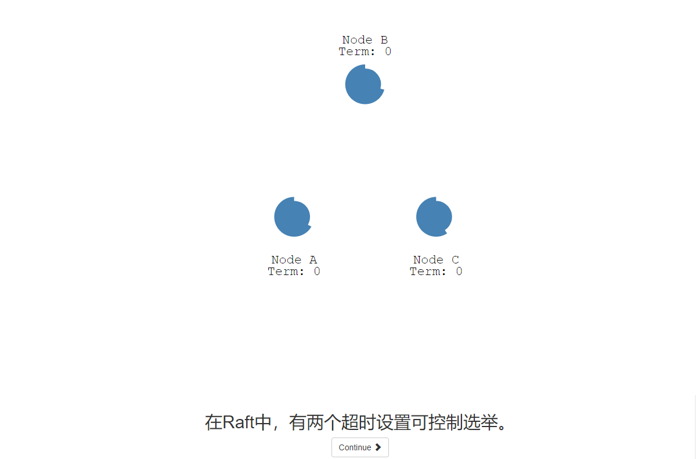
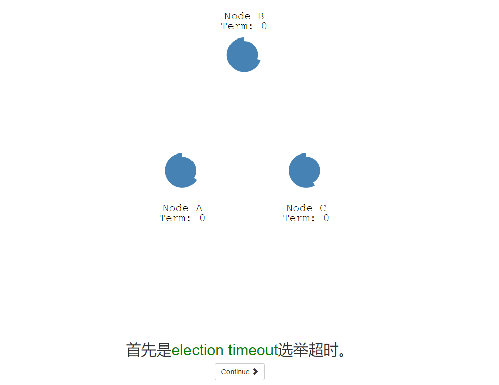
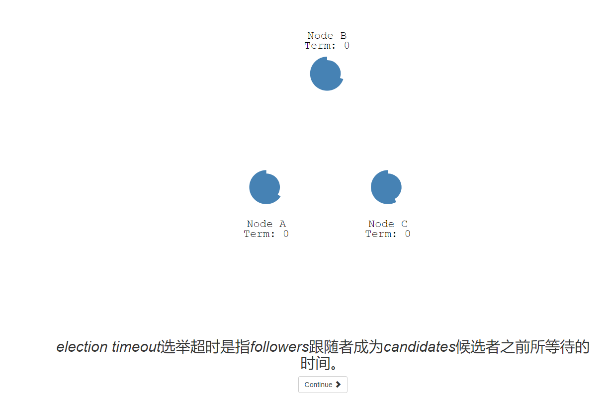
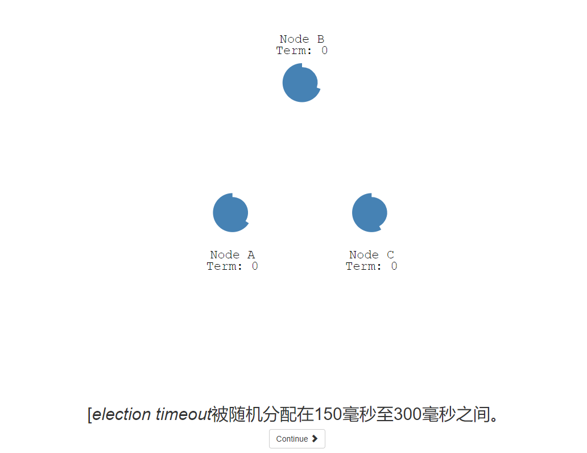
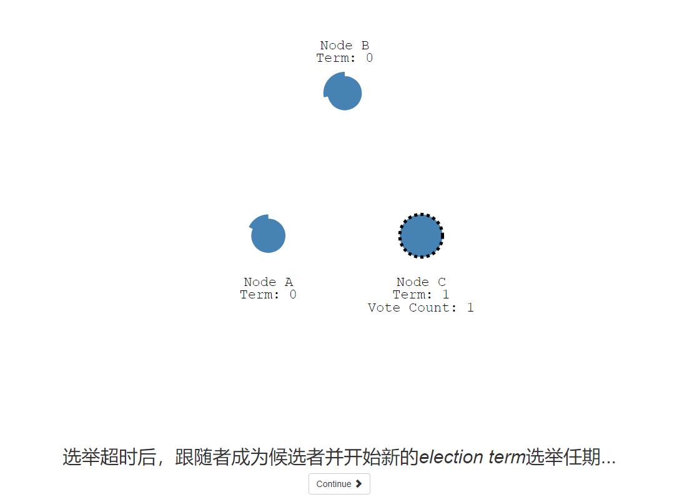

# raft-animation
Raft 动画演示中文版，在线地址：http://www.kailing.pub/raft/index.html

本仓库fork自https://github.com/benbjohnson/thesecretlivesofdata 而来，原版英文在线地址：http://thesecretlivesofdata.com/raft/

# raft算法
Raft 是一种为了管理复制日志的一致性算法。它提供了和 Paxos 算法相同的功能和性能，但是它的算法结构和 Paxos 不同，使得 Raft 算法更加容易理解并且更容易构建实际的系统。为了提升可理解性，Raft 将一致性算法分解成了几个关键模块，如领导人选举、日志复制。这个演示动画就是为了方便理解这几个关键模块而设计的。

# 演示效果

